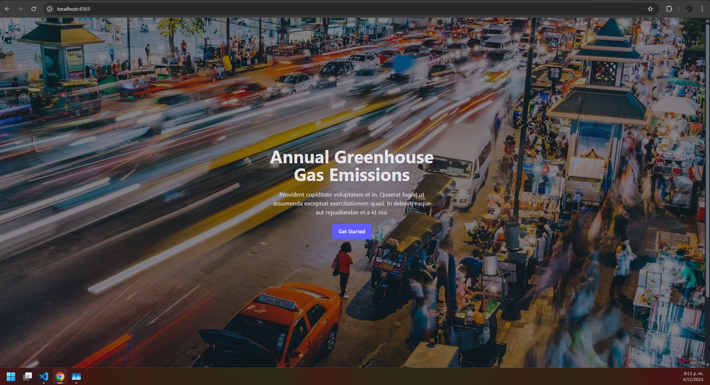
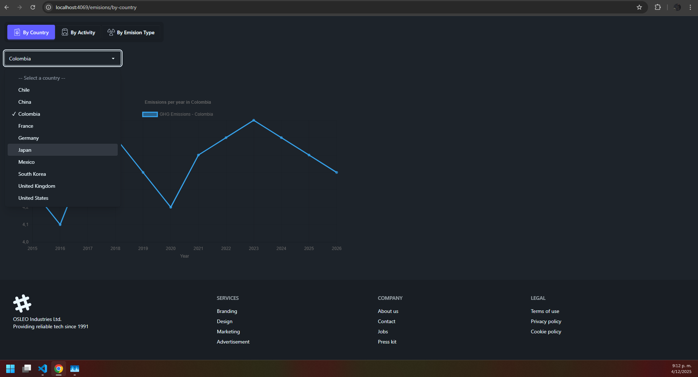
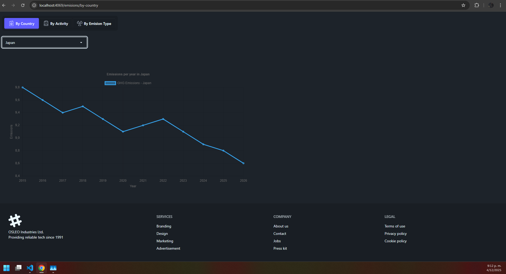
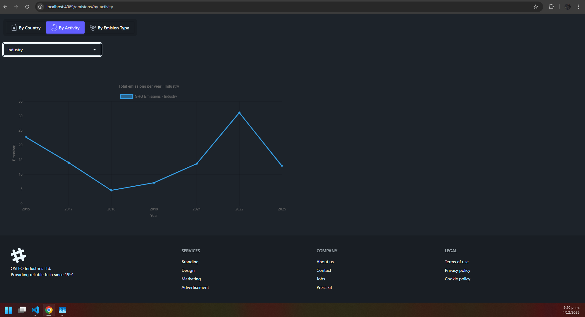
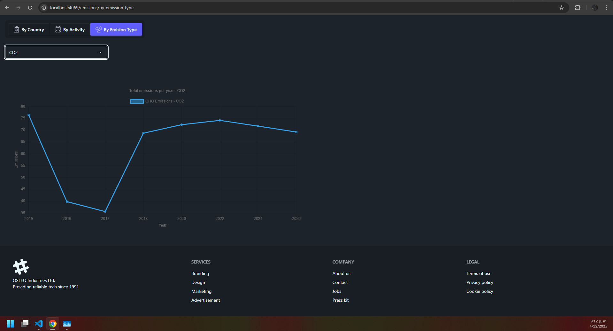

# Ghg Emissions Dashboard

This project was generated using [Angular CLI](https://github.com/angular/angular-cli) version 21.0.2.

## Technical Test
For more context about this project, you can refer to the [technical test PDF](docs/Technical%20Test%20Frontend,%20Colombia.pdf).


## Development server

To start a local development server, run:

```bash
ng serve --port=4069 -o
```

Once the server is running, open your browser and navigate to `http://localhost:4200/`. The application will automatically reload whenever you modify any of the source files.

## Code scaffolding

Angular CLI includes powerful code scaffolding tools. To generate a new component, run:

```bash
ng generate component component-name
```

For a complete list of available schematics (such as `components`, `directives`, or `pipes`), run:

```bash
ng generate --help
```

## Building

To build the project run:

```bash
ng build
```

This will compile your project and store the build artifacts in the `dist/` directory. By default, the production build optimizes your application for performance and speed.

## Running unit tests

To execute unit tests with the [Vitest](https://vitest.dev/) test runner, use the following command:

```bash
ng test
```

## Running end-to-end tests

For end-to-end (e2e) testing, run:

```bash
ng e2e
```

Angular CLI does not come with an end-to-end testing framework by default. You can choose one that suits your needs.

## Additional Resources

For more information on using the Angular CLI, including detailed command references, visit the [Angular CLI Overview and Command Reference](https://angular.dev/tools/cli) page.


## Screenshots







## Improvements & Future Enhancements

* Refactor repeated logic into a generic reusable component to be shared across the three main pages, reducing code duplication and improving maintainability.
* Centralize the data fetching logic at a higher application level so the JSON data is loaded once and reused across route changes, or alternatively, implement a caching mechanism.
* Leverage query parameters to preserve and restore the application state when navigating between different routes.


## 🐳 Docker Deployment
This frontend application is configured to be compiled and served using a lightweight Docker container, employing a Multi-Stage Build approach for maximum efficiency.

### 1. Requirements
Ensure you have Docker installed and running on your system.

### 2. Build and Run Commands
The application is deployed in two simple steps: building the image and running the container.

#### A. Building the Image (Build)

This command compiles the Angular code in production mode and packages it with the Nginx server into an image named ghg-dashboard.

Command:
```bash
 docker build -t ghg-dashboard .
```

Description: Builds the image. -t assigns the tag/name. . indicates the Dockerfile is in the current directory.


#### ⚠️ When to run this?

  - Always when there are changes to the source code (.ts, .html, .css files, etc.).

  - Always when there are changes to the dependencies (package.json, package-lock.json).

#### B. Running the Container (Run)
This command starts a container from the built image and maps a local port to the internal Nginx port.

Command:
```bash
docker run -d -p 8080:80 --name my-dashboard ghg-dashboard
```

Description:

-d,Runs the container in detached mode (in the background).

-p 8080:80,Maps local port 8080 to the internal container port 80 (where Nginx is serving the app).

--name my-dashboard,Assigns an easy-to-remember name to the container.

ghg-dashboard,This is the name of the image we just built.

#### ⚠️ When to run this?

  - Only once to start the container for the first time.

  - If you stop the container, do not use docker run again (it will generate a name conflict error). Instead, use docker start my-dashboard.

###  3. Control Commands and Access URL
#### Application URL
Once the container is running (after a successful docker run), you can access the application in your browser at the following address:

➡️ http://localhost:8080


#### Maintenance Commands
Here are some useful commands for managing the container:
```bash
Task - Command:
View Logs --->  docker logs -f my-dashboard (Useful for debugging)
Stop --->  docker stop my-dashboard
Start --->  docker start my-dashboard
Remove Container --->  "docker rm my-dashboard (Removes the container --->   not the image)"
Remove Image --->  docker rmi ghg-dashboard (Only if no longer needed)
```

#### 🚨 Quick Update Flow
If you make a code change and want to see it reflected in the application:

  - Stop the current container: docker stop my-dashboard

  - Remove the old container: docker rm my-dashboard

  - Rebuild the image with the changes: docker build -t ghg-dashboard .

  - Run the new container: docker run -d -p 8080:80 --name my-dashboard ghg-dashboard
